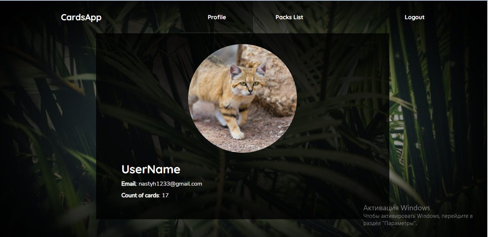

# CardsApp 

<a href="https://nastyaz23.github.io/fridayProject/">
  <div>
   <h3><a href="https://nastyaz23.github.io/fridayProject/">Link to app </a></h3>
  </div>
</a>

Web app for learning.
<br/>
<br/>
Thanks to the application, you can study on your own topics or study the cards of other users. The functionality allows you to evaluate the question and, based on the assessment, the frequency of displaying this question changes, which allows you to fix questions that you don't know. You can delete, edit questions and topics themselves.


<br/>
<br/>

On the profile page you can change your profile photo and username, as well as information about the number of your cards.

<br/>
<br/>



<br/>
<br/>

On the Packs page you can create, delete, edit your packs. Study the cards of other users. The following functionalities are available: sorting, searching, filtering, pagination.


<br/>
<br/>

On the card page you can create, edit or delete the card.

<br/>
<br/>

Also implemented the processes of registration, authorization, password recovery using mail.
<br/>

## Launch of the project ⏯

<br/>

To start the project, you need to enter the folder - 📂 fridayProject and type the command in the terminal:

```javascript
yarn
```

<br/>


Type command in terminal:

```javascript
yarn start
```

<br/>


